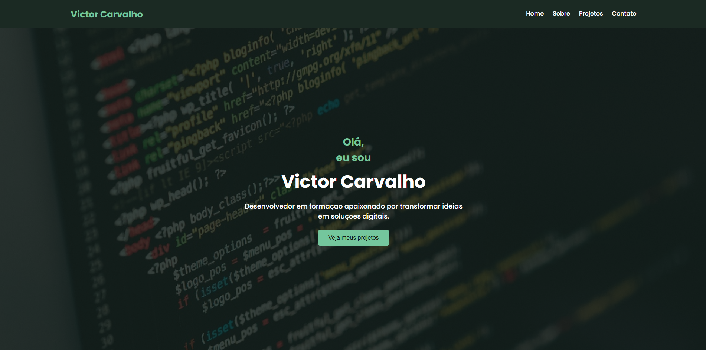

# 💼 Portfólio - Victor Carvalho

Este é o meu primeiro projeto de portfólio pessoal desenvolvido com HTML e CSS, com foco em **responsividade** e **boas práticas de estruturação web**. O objetivo deste projeto é apresentar minhas habilidades iniciais como desenvolvedor Front-End.

## 🔗 Acesse online:
👉 [Clique aqui para ver o site publicado](https://victorcarvalhob.github.io/portfolio-victor/)

## 🚀 Tecnologias utilizadas:
- HTML5 semântico
- CSS3 moderno
- Flexbox para layout responsivo
- Media Queries para adaptação em diferentes tamanhos de tela

## 📱 Compatibilidade:
- 💻 Desktop
- 📱 Tablets
- 📲 Celulares (incluindo iPhone SE, Galaxy S8 e outros)

## 📸 Preview

---

Desenvolvido com 💚 por **Victor Carvalho** — buscando minha transição para o mundo da programação.
